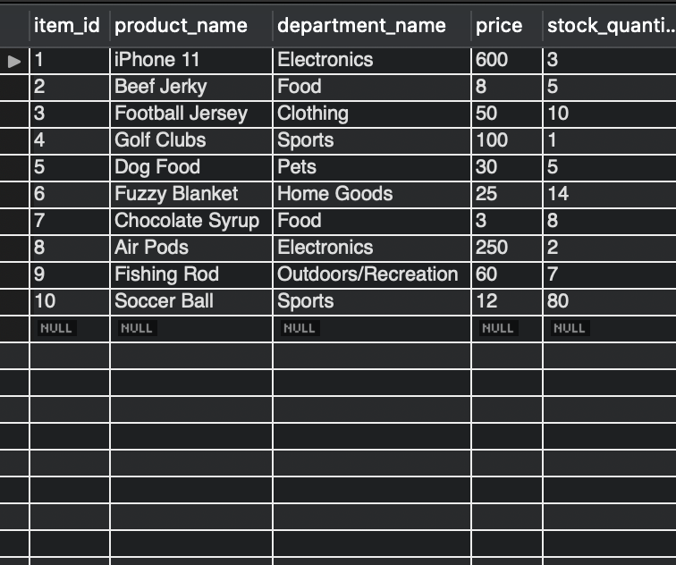
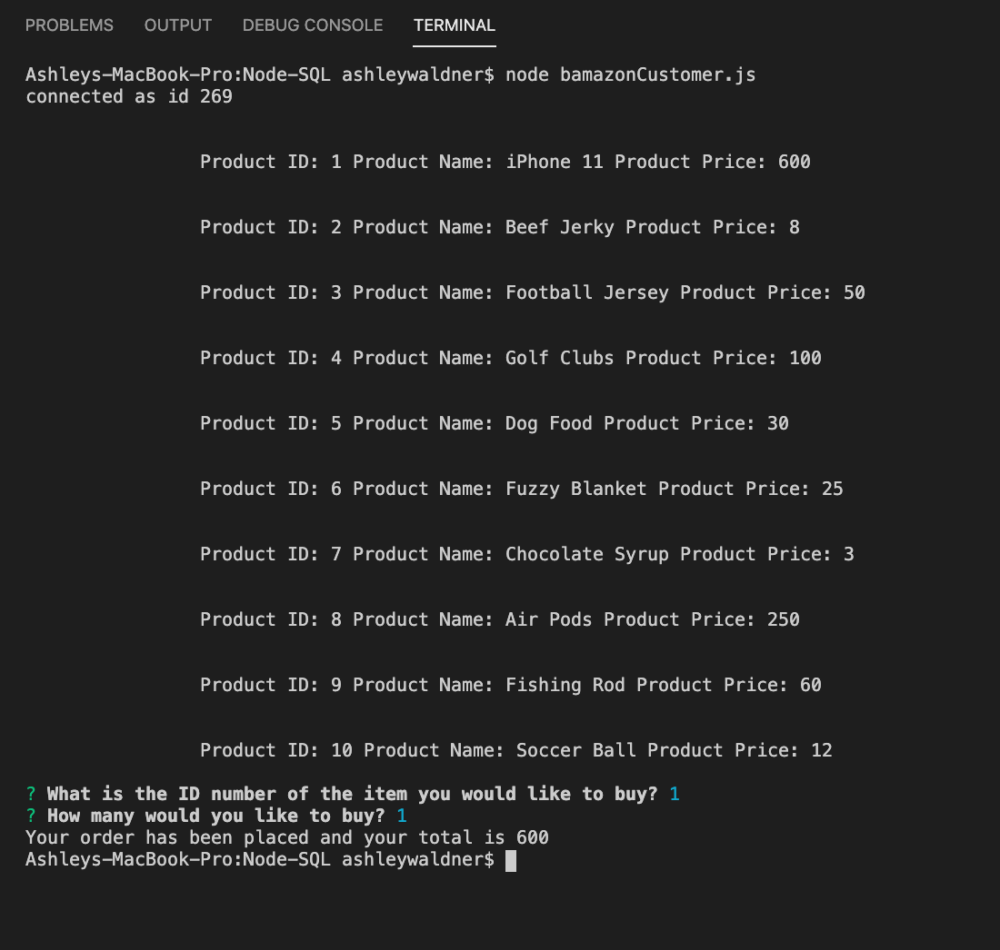
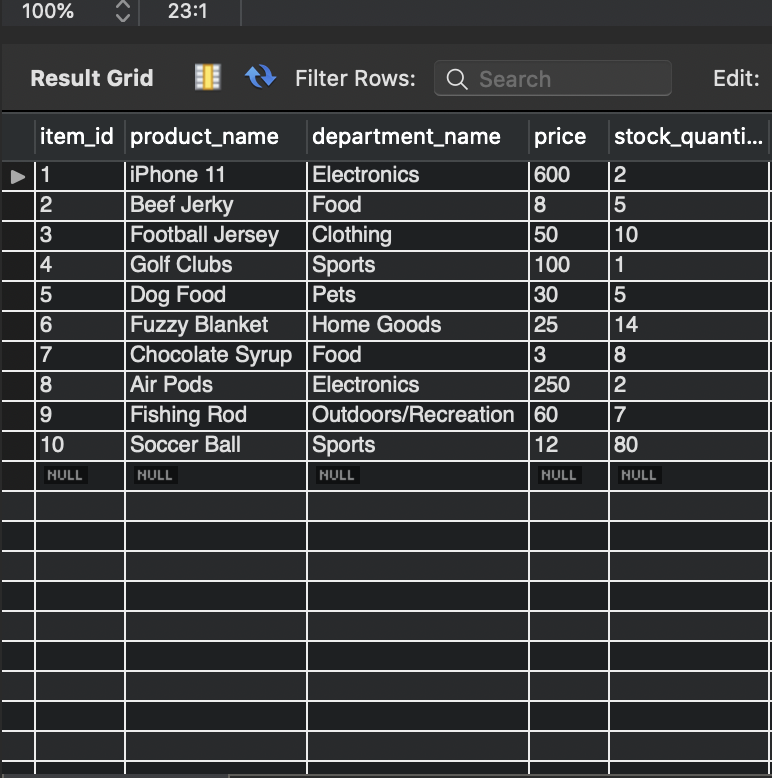
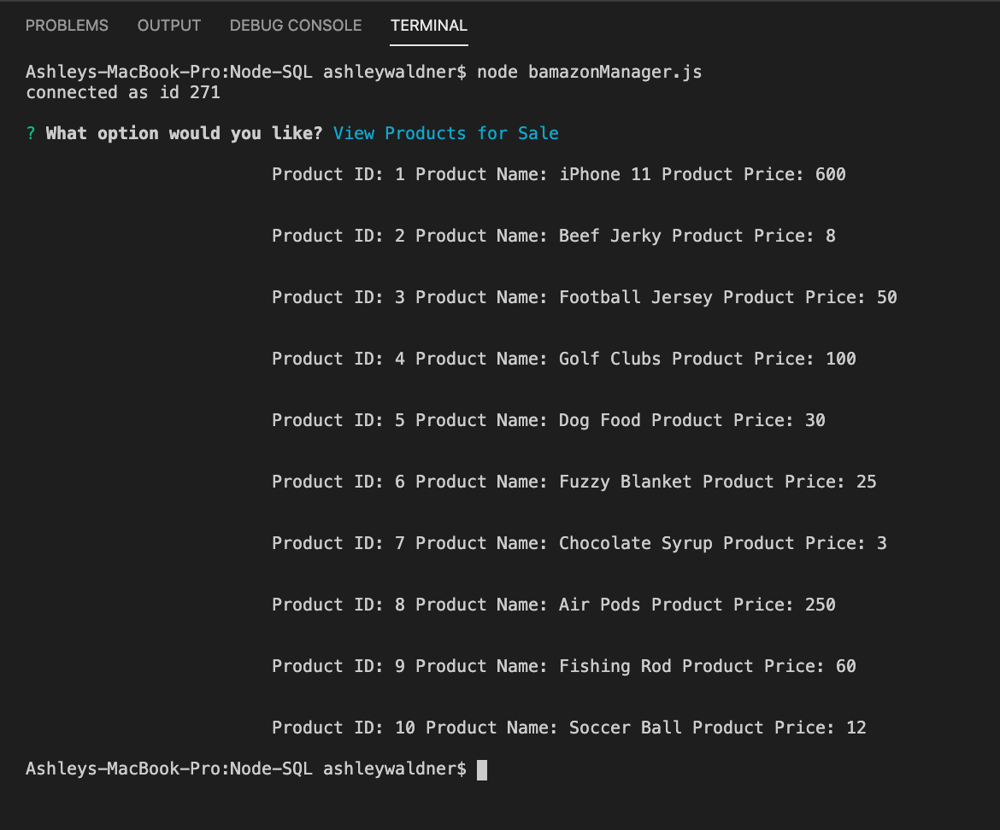
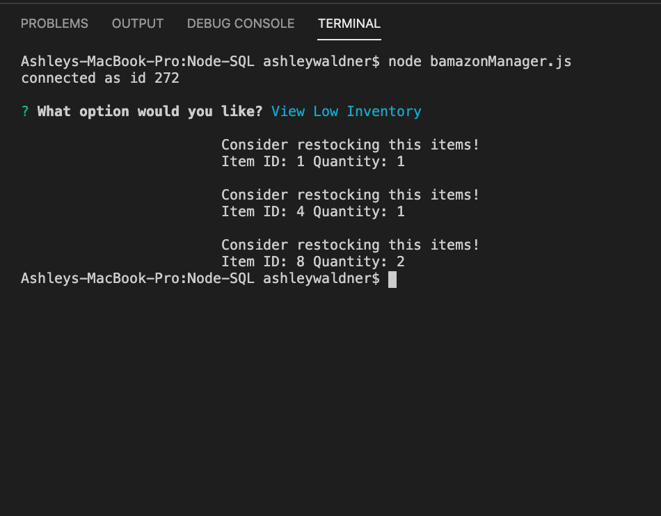
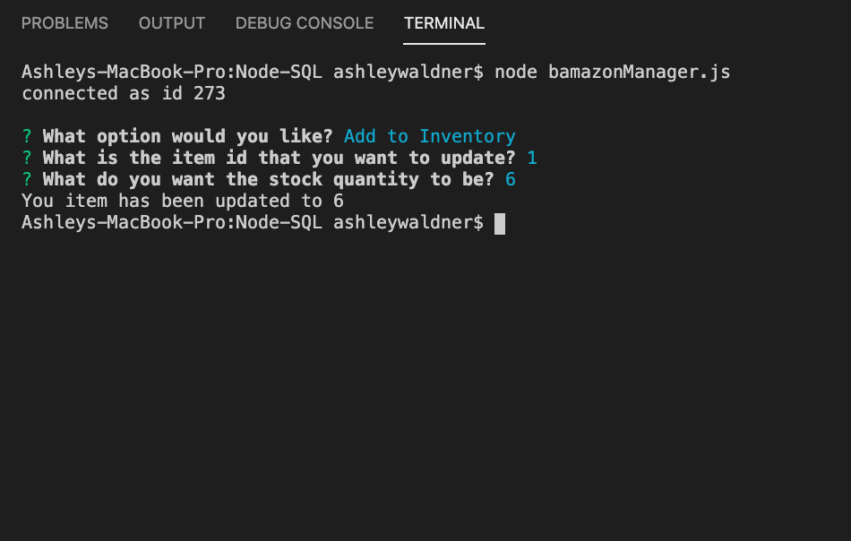
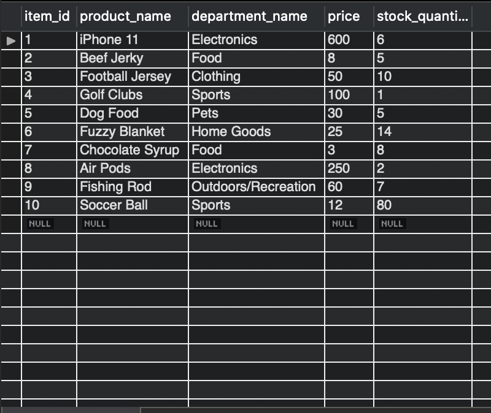
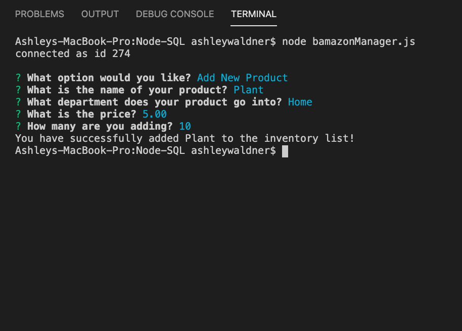
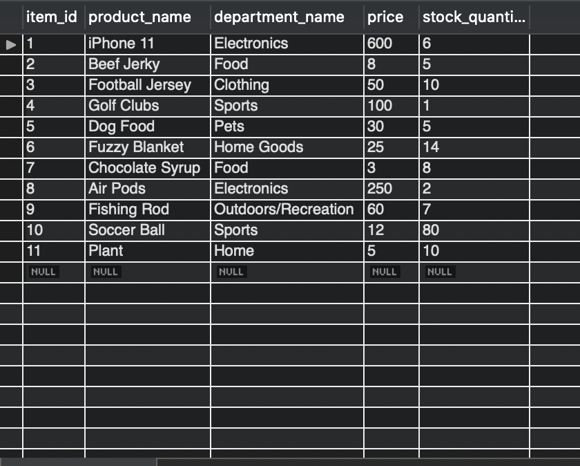

# Bamazon
Bamazon is a command line app where in the customer app the user can find the item id and use that id to get the products total. In the manager file the user can see all items listed, the low inventory items, update inventory numbers, and add new items.

# purspose
The purpose of this application is to demostrate the use of node and sql working together.

# what it uses
Inquirer Package
MySQL Database

# PSUEDOCODE
PART I

1. make the database

2. make connection

3. get user input with inquirer

4. get data from database

5. compare data to user input 

PART II

1. set up inquirer to display list of commmands

- view products for sale: list the all current products ids, names, prices, and quanities
- view low inventory: list all items with counts lower than 5
- add to inventory: set up prompt that asks user to choose an id that they would like to add more to then ask how many more then update the id to reflect the new info
- add new product: insert new row by using inquirer to gather the needed info

# instructions 
The user will be prompted to select what they want to do. Once they choose an option they follow the instructions that happen in terminal to complete the actions.

# screen shots of working app
The SQL database table before any commands are ran

The terminal after customer file is ran

The SQL Database after the cusomter database was ran and an item_id 1 was purchased

The terminal after the view products for sale command was ran

The terminal after the view low inventory command was ran

The terminal agter the update inventory command is ran

The SQL database after the update inv command was ran

The terminal after the add product command was ran

The SQL Database after the add product command was ran

# deployed links
Portfolio: https://awald220.github.io/AW-Portfolio/portfolio.html

GitHub: https://github.com/awald220/Node-SQL

# role in creating application 
I completed all of the parts needed creat this application.
